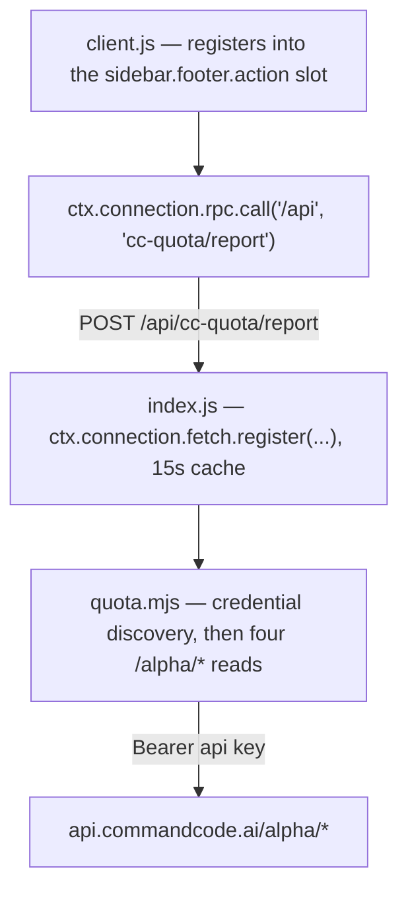

# dsh-commandcode-quota

**Command Code plan quota in your DeepSeek Harness sidebar** — 5-hour, weekly, and monthly credit windows at a glance, rendered right above the Settings row.

**English** | [简体中文](README.zh-CN.md)

[](LICENSE)
[](https://github.com/deepseek-ai/deepseek-harness)
[](#requirements)
[](#contributing)


---

## Why

Command Code sells a cheap subscription with three independent budget windows, and the only place to see them is the vendor's own site. If you drive Command Code from DeepSeek Harness (this plugin's own author runs the **GOAT** plan through it), you have no idea how close you are to a wall until a request fails.

This plugin puts the three windows where you already look — the bottom of the sidebar, directly above **Settings** — so the answer is one glance away instead of one browser tab away.

## What it shows

| Window | What it means | Reported |
|---|---|---|
| **5 小时** (5-hour) | Rolling burst limit, so one long session cannot drain the month | `$14` of usage on GOAT |
| **每周** (weekly) | Rolling 7-day limit | `$35` of usage on GOAT |
| **月度** (monthly) | Your plan's credit allowance for the billing period | `$70` of usage on GOAT |

Rows run **shortest window first**, so the tightest constraint sits where your eye lands. Each row shows:

- the **used percentage** as the value, colour-coded by urgency (green < 60 %, amber < 85 %, red above),
- a full-width **progress meter** in the same colour,
- a muted **reset countdown** (`59m`, `6d9h`, `8d1h`) so you know when it comes back.

Click the card to expand the amounts behind the percentages, the billing-period totals, and the burn-rate projection. Collapse the sidebar to its 56 px rail and the card becomes a 36 px badge showing the shortest window's percentage.

Everything the card shows comes from **your account's own data** — window count, caps, and percentages are read from the API, never assumed. Plans that report no rolling windows (pay-as-you-go **Provider**, for instance) simply render no rows. Go, GOAT, Pro, Max 10×, Max 20×, Provider, and Teams all work.

## Requirements

- **DeepSeek Harness** `^0.1.5-rc.1` (dsh). The plugin uses private framework seams; see [Compatibility](#compatibility).
- A **Command Code** account with API access. Every plan except the `$1` **Go** plan includes it.
- Node.js 18+ (only for the optional standalone CLI).

## Install

### 1. Install the package into a profile

```sh
# straight from GitHub
dsh plugin --profile web add github:Jovan1666/dsh-commandcode-quota

# or from a local clone
git clone https://github.com/Jovan1666/dsh-commandcode-quota
dsh plugin --profile web add ./dsh-commandcode-quota
```

`dsh plugin` forwards to pnpm inside the profile directory, so the package name must be resolvable from `$DSH_HOME/profiles/web/node_modules`.

### 2. Register the plugin row

`dsh plugin add` installs the dependency but does **not** compose the plugin. Add one insert block to the profile's patch layer, `$DSH_HOME/profiles/web/cordis.patch.yml`:

```yaml
- insert:
    - id: commandcode-quota
      name: "dsh-commandcode-quota"
```

> Quote the value. The loader imports `name` as a module specifier and it must match the installed package name exactly.

### 3. Restart and refresh

```sh
# stop the running dsh web, then:
dsh web
```

Reload the browser page afterwards — the boot manifest (`window.__DSH_BOOT__`) is injected when the page is served, so a plugin that appears after the page loaded will not be fetched until you reload.

### Alternative: manual install without pnpm

If you would rather not touch the profile's dependency graph, link the directory yourself and add the same `insert` block:

```powershell
New-Item -ItemType Junction `
  -Path "$env:DSH_HOME\profiles\web\node_modules\dsh-commandcode-quota" `
  -Target "C:\path\to\dsh-commandcode-quota"
```

## Configuration

**None.** Install it and it finds your credentials. See [Credentials](#credentials).

## Usage

| Action | Result |
|---|---|
| Look at the sidebar foot | Three windows, percentages, meters, reset countdowns |
| Click the card | Expand amounts, period totals, token counts, burn-rate projection |
| Hover a row | Exact `used / cap`, remaining credit, and the absolute reset time |
| Collapse the sidebar | The card becomes a 36 px rail badge with the shortest window's percentage |

The card refreshes every 60 seconds; the host caches for 15 seconds on top of that, so it never hammers the API.

## Credentials

The API key never reaches the browser. The host half resolves it in this order, stopping at the first hit — and the reported `credentialSource` tells you which one won:

1. An explicitly passed key (the CLI's `--key`).
2. **Discovered from your own `$DSH_HOME/settings.yaml`**: any provider route whose `baseURL` points at `commandcode.ai`. The plugin reads that route's literal `apiKey` or its `apiKeyEnv`, then resolves the name through the environment and `$DSH_HOME/.credentials.yaml`. The provider's target host is kept (so a staging or proxy host works), but only its origin — the quota endpoints live at the host root, not under the provider's `/provider/v1` path.
3. Environment variables: `COMMANDCODE_API_KEY`, `COMMAND_CODE_API_KEY`, `CMD_API_KEY`, then **any** variable whose name contains `commandcode`.
4. The names above inside `$DSH_HOME/.credentials.yaml` (`refs.<NAME>`) or `~/.dsh/.credentials.yaml`.
5. `~/.commandcode/auth.json`, the official `command-code` CLI's login state.

Step 2 is what makes this work for other people: it follows **your** provider configuration instead of hardcoding one naming convention. If you already configured Command Code as a DSH provider (Settings → Models), there is nothing else to do.

## Compatibility

The plugin depends on framework seams that are not part of a stable public API yet. Each one is pinned to what `dsh 0.1.5-rc.1` actually exposes:

| Seam | Used for |
|---|---|
| `sidebar.footer.action` slot | The seat above Settings, in both sidebar widths |
| `ctx.slots.register({ name, id, order, inject }, Component)` | Contributing the card |
| `ctx.connection.rpc.call(channel, endpoint, payload, signal)` | The browser side of the request |
| `ctx.connection.fetch.register({ path, methods, requestBody, fetch })` | The host side of the route |
| `dsh.client` manifest + `exports["./client"]` | Client-bundle discovery, served at `/plugins/<id>/client.js` |

> **Why an exact Fetch route instead of `connection.rpc.handle`?** `rpc.handle` mounts its channel through `owner.webServer`, where `owner` is the Connection service's own context — which never injects `webServer`. Calling it from any other plugin throws `cannot get property "webServer" without inject`, regardless of what the caller injects. `connection.fetch.register` only writes the route table, works from any plugin fiber, and inherits the shared `/api` transport's Host/Origin fence and browser-session cookie.

If a future dsh release changes one of these, the plugin fails loudly at load rather than silently rendering nothing.

## Standalone CLI (optional)

The same data layer ships as a zero-dependency read-only CLI, useful for headless machines and for checking a second account:

```sh
node cli/cli.mjs              # render once
node cli/cli.mjs --watch 60   # refresh every 60 seconds
node cli/cli.mjs --json       # normalized report for scripts
node cli/cli.mjs --help
```

```text
Command Code · GOAT · Jovan1666
月度额度  已用 98.6%，剩 $0.96，09-25 17:08 重置
5 小时    已用 24.9%，剩 $10.51，今天 16:55 重置
每周      已用 10.4%，剩 $31.37，09-24 01:51 重置
```

Flags: `--json`, `--watch [seconds]`, `--ascii`, `--color` / `--no-color`, `--base <url>`, `--timeout <ms>`, `--key <key>`.

Error codes (exit code 2): `MISSING_CREDENTIAL`, `AUTH`, `NOT_FOUND` (usually a plan without API access), `RATE_LIMIT`, `SERVICE`, `NETWORK`, `BAD_RESPONSE`, `USAGE`.

## Troubleshooting

| Symptom | Cause and fix |
|---|---|
| No card at all after restarting | The `insert` block is missing, or `name` does not match the installed package. Check `dsh --profile web --dump-config` lists your row. |
| Card renders but shows an error | The host route failed. Hover the card: the message carries the data layer's error code. `MISSING_CREDENTIAL` means the key was not found (see [Credentials](#credentials)); a `404` usually means the plan has no API access. |
| `/plugins/dsh-commandcode-quota/client.js` returns 404 | The client bundle was not composed. Confirm `dsh.client.platform === "web"` and that `exports["./client"]` exists in `package.json`. |
| Edits to `client.js` do not appear | The bundle is served from disk per request, so a page reload is enough — but the row must already be composed. Edits to `index.js` or `quota.mjs` need a `dsh web` restart because Node caches the modules. |
| Everything shows `—` | The account reports no windows (pay-as-you-go plans) or the report is still loading. |

## Privacy

- Your API key stays on the host. The browser never receives it; it only receives the normalized report over the same-origin `/api` transport, which is additionally fenced to loopback and requires this process's browser-session cookie.
- The plugin talks only to your Command Code account's API. There is no telemetry, no analytics, and no third-party endpoint.
- Nothing is persisted: every refresh is a live read of four read-only endpoints.
- The only local files read are the credential and settings files named in [Credentials](#credentials).

## How it works



| File | Role |
|---|---|
| `client.js` | Browser half: the card, its stylesheet, and the polling hook. Hand-written bundle — no build step, so it uses `React.createElement` instead of JSX and consumes only `react` from the harness's static module table. |
| `index.js` | Host half: one exact Fetch route on the shared `/api` transport, plus the response cache. |
| `quota.mjs` | Data layer: credential discovery, the four read-only endpoints, and normalization into a display-agnostic report. Shared by the plugin and the CLI. |
| `cordis.patch.yml` | The insert block a profile composes to load the plugin. |

Upstream endpoints (all read-only `GET`, Bearer auth):

| Endpoint | Fields used |
|---|---|
| `/alpha/whoami` | account identity, `org.id` |
| `/alpha/usage/summary` | `totalCredits` (used this period), request count, success rate, tokens |
| `/alpha/billing/credits` | `credits.monthlyCredits` (remaining), `windowLimits.fiveHour` / `.weekly` |
| `/alpha/billing/subscriptions` | `planId`, `status`, `currentPeriodStart/End` |

Each endpoint degrades independently: one failure is recorded in the report's `failures` and the rest still render. All four failing raises a single error carrying the most specific code.

## Development

```sh
# 1. React is needed only by the component test and the preview page.
mkdir .devdeps && cd .devdeps
npm init -y && npm install react@18 react-dom@18
cd ..

# 2. Offline tests — 40 checks, no network, no real credentials.
node tests/quota.test.mjs     # 15  route discovery, credential order, plan table
node tests/host.test.mjs      #  9  route registration, cache, envelope guards, failures
node tests/client.test.mjs    # 16  slot registration, injected face, five render states

# 3. Optional: verify nothing credential-shaped or machine-specific is staged.
node scripts/audit.mjs
```

### Previewing the card without restarting dsh

Editing styles by restarting a live `dsh web` is slow. `preview/build.mjs` renders the **real `client.js`** into a mock sidebar — real theme tokens, light/dark, collapsed/expanded side by side — and Chrome's headless screenshot mode captures it:

```sh
node preview/build.mjs
chrome --headless=new --disable-gpu --hide-scrollbars \
  --force-device-scale-factor=2 --window-size=860,470 --virtual-time-budget=5000 \
  --screenshot=preview/shot.png "file://$PWD/preview/index.html"
```

The theme's design tokens are extracted by merging **every** `body{}` and `body[data-ds-dark-theme]{}` block from the installed `dsh-client-ui-theme` bundle. Taking only the last block drops `--dsw-alias-state-*`, which turns every meter transparent — a trap this repo has already fallen into once.

## Known limitations

- **Polling, not push.** The panel refreshes every 60 seconds (15-second host cache). Credit changes can lag by up to a minute.
- **No per-model allowance breakdown.** Command Code allocates a per-model share of the monthly budget, but the `/alpha` endpoints do not expose that table, so the card reports the total only.
- **The burn-rate projection is a period average.** It divides credits used by elapsed days, so it ignores a recent change of model or workload.
- **No history.** Every read is a live snapshot; nothing is stored locally.
- **Command Code only.** This does not replace dsh's own local token accounting, which lives in `$DSH_HOME/dsh-usage/`.
- **Private framework seams.** See [Compatibility](#compatibility).

## Contributing

Issues and pull requests are welcome. Please run the three offline tests before opening a PR, and keep the styling on the harness's `--dsw-alias-*` design tokens — the test suite asserts that the stylesheet contains no literal colours.

## Credits

The endpoint contract and plan table were cross-checked against [`@mars-sea/dsh-commandcode-provider`](https://github.com/Mars-Sea/dsh-commandcode-provider) (MIT), which is the unofficial provider plugin for the same service.

## License

[MIT](LICENSE)
