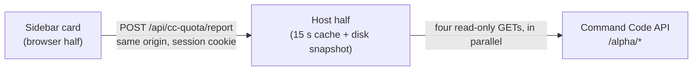

<div align="center">

# Command Code quota for DeepSeek Harness

**Your 5-hour, weekly and monthly credit windows, in the sidebar — right above Settings.**

No browser tab, no login, no guessing how much of the plan is left.

[](LICENSE)
[](https://github.com/deepseek-ai/deepseek-harness)
[](#requirements)
[](#contributing)


</div>

---

## What you get

| | |
|---|---|
| **Three windows, one glance** | 5-hour, weekly and monthly, shortest first — so the tightest limit is where your eye lands |
| **Percentage first** | The headline rounds to a whole percent, exactly like the Command Code dashboard, so the card and the website never disagree |
| **Money where it matters** | Used and remaining for the monthly allowance; exact figures for every row on hover |
| **Instant, then live** | The card is on screen about 2 ms after a restart, and live about a second later |
| **Quiet when it should be** | No Command Code account? The card does not render at all |
| **Bilingual** | Follows your DSH interface language (中文 / English) |

Everything is read from **your own account's data** — window count, caps and percentages come from the API, never assumed. Go, GOAT, Pro, Provider, Max and Teams all work; a plan that reports no rolling windows simply renders no rows.

## Install

```sh
# 1. put the package into a profile
dsh plugin --profile web add github:Jovan1666/dsh-commandcode-quota
```

```yaml
# 2. register the plugin row — append to $DSH_HOME/profiles/web/cordis.patch.yml
- insert:
    - id: commandcode-quota
      name: "dsh-commandcode-quota"
```

```sh
# 3. restart dsh web, then reload the browser page
```

Then look at the bottom of the sidebar. That is the whole setup — no configuration file, no API key to paste: if Command Code is already a provider in your DSH settings, the plugin finds it.

<details>
<summary>Other ways to install, and how to remove it</summary>

**From a local clone**

```sh
git clone https://github.com/Jovan1666/dsh-commandcode-quota
dsh plugin --profile web add ./dsh-commandcode-quota
```

**Manually, without pnpm** — link the folder into the profile's `node_modules` and add the same `cordis.patch.yml` row as above:

```sh
# macOS / Linux
ln -s "$PWD/dsh-commandcode-quota" "$DSH_HOME/profiles/web/node_modules/dsh-commandcode-quota"
```

```powershell
# Windows
New-Item -ItemType Junction -Path "$env:USERPROFILE\.dsh\profiles\web\node_modules\dsh-commandcode-quota" -Target "$PWD\dsh-commandcode-quota"
```

**To remove it:** delete the `cordis.patch.yml` row, drop the package from the profile, restart `dsh web`. To clear the cached snapshot too, delete `$DSH_HOME/dsh-commandcode-quota/`.

</details>

## Why it appears before you look

The card used to wait out a full upstream round trip before drawing anything, and a restarted dsh has nothing cached — which is exactly the "it takes a moment to show up" feeling. Measured against the live API with `node preview/latency.mjs`:

| | |
|---|---|
| First answer after a restart, snapshot on disk | **~2 ms** |
| First answer after a restart, no snapshot yet | ~1.4 s |
| The four endpoints requested one after another | ~2.3 s |
| The four endpoints requested together | ~1.2 s |

Two things make the difference:

1. **All four endpoints are requested at once.** `whoami` used to be awaited on its own — about 590 ms of pure waiting, to learn an org id that personal accounts never report.
2. **The last good report is kept on disk.** A cold start answers with it immediately — dimmed, and labelled with how old it is — while a live read runs behind it. The card re-asks 3 seconds later instead of waiting out the usual minute, so the numbers are live by the time you have read them.

## How to read the card

| Window | What it means | On GOAT |
|---|---|---|
| **5 小时** | Rolling burst limit — one long session cannot drain the month | `$14` |
| **每周** | Rolling 7-day limit | `$35` |
| **月度** | The billing period's credit allowance | `$70` |

Each row shows the **used percentage** (green below 60 %, amber below 85 %, red above), a meter in the same colour, and a **reset countdown** (`59m`, `6d9h`, `8d1h`). Click the card for the monthly allowance in money, the remaining credit, the request count and the token totals. Collapse the sidebar and the card becomes a 36 px badge showing the **most constrained** window.

### Reading the numbers

- Percentages are `used ÷ (used + remaining)`, read live from the API. `preview/e2e-live.mjs` asserts that identity against a real account on demand.
- The headline rounds to a whole percent, the same way the dashboard does. That is why the website can say `100%` while the exact share is `99.84%` — same data, two roundings. The exact figure and the money are one hover away.
- The monthly cap is the sum of two figures from two different endpoints. Across a billing-period rollover or a plan change those two can describe different periods, and the sum would look plausible while being wrong by tens of percent. The plan's nominal allowance is the sanity check; when a read fails it, the host reports **no percentage at all** and the card says why. The next refresh corrects it.

### What the card deliberately leaves out

The sidebar is about 200 px of content width, and a laptop screen makes small type smaller still. So the card answers one question well — *how deep am I?* — instead of laying out everything the API returns:

- **Money only for the monthly allowance.** The 5-hour and weekly windows are pass/fail gates, not budgets; their dollar rows told a user nothing they could act on. Hover still shows exact figures.
- **No pace verdict, no burn-rate forecast.** "Over pace" cannot be acted on by someone who has work to do, and a projected exhaustion date assumes a constant burn rate that credit usage never has. The host still exposes `projection` in its JSON for scripts.
- **Nothing silent.** A row that disappears because its endpoint failed says so; a failure with nothing to fall back on says what went wrong in one readable line, with the full diagnostic text on hover.

## The `/quota` command

Type `/quota` in a conversation to print the same report as text:

```text
Command Code · GOAT (active)
5-hour 1.4% used · resets in 3h17m
Weekly 12.8% used · resets in 6d7h
Monthly 99.8% used · $70.11 / $70.23 · $0.11 left · resets in 7d22h
18,087 requests · 100% success · in 3.49B / out 16.77M
```

It reads the same cached report the card does, so a slash invocation costs no extra upstream requests — and unlike the card, it never answers from a stale snapshot: typing a command means asking for the current numbers.

## Requirements

- **DeepSeek Harness** `^0.1.5-rc.1`. The plugin uses framework seams that are not a stable public API yet; see [Compatibility](#compatibility).
- A **Command Code** account with API access. Every plan except the `$1` **Go** tier includes it.
- Node.js 18+ — only for the optional CLI and the development scripts.

## Credentials

The API key never reaches the browser. The host resolves it in this order and reports which source won:

1. An explicitly passed key (the CLI's `--key`).
2. **Discovered from your own `$DSH_HOME/settings.yaml`** — any provider route whose `baseURL` points at `commandcode.ai`. The plugin reads that route's literal `apiKey` or its `apiKeyEnv`, then resolves the name through the environment and `$DSH_HOME/.credentials.yaml`. The provider's host is kept (a staging host or proxy works), but only its origin: the quota endpoints live at the host root, not under the provider's `/provider/v1` path.
3. Environment variables: `COMMANDCODE_API_KEY`, `COMMAND_CODE_API_KEY`, `CMD_API_KEY`, then **any** variable whose name contains `commandcode`.
4. Those same names inside `$DSH_HOME/.credentials.yaml` (`refs.<NAME>`).
5. `~/.commandcode/auth.json`, the official `command-code` CLI's login state.

Step 2 is what makes this work for other people: it follows **your** provider configuration instead of hardcoding one naming convention.

<details>
<summary><strong>How it works</strong> — endpoints, seams, and the one that bit us</summary>



| Endpoint | Used for |
|---|---|
| `/alpha/whoami` | Account name, org id |
| `/alpha/usage/summary` | Credits used this period, requests, success rate, tokens |
| `/alpha/billing/credits` | Remaining credits, the 5-hour and weekly windows |
| `/alpha/billing/subscriptions` | Plan id, status, billing-period start and end |

Each endpoint degrades on its own: one failure is recorded in the report's `failures`, is shown on the card as a muted line, and the rest still render. All four failing raises one error with the most specific code — including "this plan has no API access" when all four answer 404.

</details>

## Compatibility

The plugin depends on framework seams that are not a stable public API yet. Each is pinned to what `dsh 0.1.5-rc.1` actually exposes:

| Seam | Used for |
|---|---|
| `sidebar.footer.action` slot | The seat above Settings, in both sidebar widths |
| `ctx.slots.register({ name, id, order, inject }, Component)` | Contributing the card |
| `ctx.connection.rpc.call(channel, endpoint, payload, signal)` | The browser side of the request |
| `ctx.connection.fetch.register({ path, methods, requestBody, fetch })` | The host side of the route |
| `ctx.get('commands')` + `commands.register({ name, description, handler })` | The optional `/quota` command |
| `dsh.client` manifest + `exports["./client"]` | Client-bundle discovery, served at `/plugins/<id>/client.js` |

> **Why an exact Fetch route instead of `connection.rpc.handle`?** `rpc.handle` mounts its channel through `owner.webServer`, where `owner` is the Connection service's own context — which never injects `webServer`. Calling it from any other plugin throws `cannot get property "webServer" without inject`, whatever the caller injects. `connection.fetch.register` only writes the route table, works from any plugin fiber, and inherits the shared `/api` transport's Host/Origin fence and browser-session cookie.

If a future dsh release changes one of these, the plugin fails loudly at load rather than silently rendering nothing.

## Standalone CLI

The same data layer ships as a zero-dependency read-only CLI — useful on a headless machine, or for checking a second account:

```sh
node cli/cli.mjs              # render once
node cli/cli.mjs --watch 60   # refresh every 60 seconds
node cli/cli.mjs --json       # normalized report for scripts
node cli/cli.mjs --help
```

```text
Command Code · GOAT（individual-goat） · Jovan1666
key: $DSH_HOME/.credentials.yaml → refs.COMMAND_CODE_GOAT_API_KEY

5 小时     ---------------------------- 1.4%
           今天 21:55 重置（2 小时 4 分后）

每周       ####------------------------ 12.8%
           09-24 01:51 重置（6 天 6 小时后）

月度额度   ############################ 99.8% · $70.11 / $70.23
           剩余 $0.11 · 09-25 17:08 重置（7 天 21 小时后）
本周期  18,087 请求 · 成功率 100% · in 3.49B / out 16.77M tokens
```

Shown with `--ascii`, and deliberately so: the default bars are drawn with full-height block glyphs, which sit flush against the text line beside them in many code fonts — in this very README the weekly bar merged with the 5-hour countdown above it. `#` and `-` are ordinary glyphs and travel everywhere. There are also no rule lines and no right-aligned columns, so every line stands on its own instead of depending on character-cell widths.

Flags: `--json`, `--watch [seconds]`, `--ascii`, `--color` / `--no-color`, `--base <url>`, `--timeout <ms>`, `--key <key>`.

The CLI's human-readable output is Chinese; `--json` is language-neutral and is the interface to script against. It follows the card's presentation rules — money on the monthly allowance only, no pace verdict and no burn-rate forecast (those remain in the JSON).

## Troubleshooting

| Symptom | What it means |
|---|---|
| No card at all | This host has no Command Code provider configured, so the plugin stays invisible by design. Check Settings → Models. |
| The card shows an error | The card says what it can ("cannot reach Command Code", "the API key was rejected"); hover it for the full diagnostic text. |
| `/plugins/dsh-commandcode-quota/client.js` returns 404 | The client bundle was not composed. Check that `package.json` declares `dsh.client.platform === "web"` and `exports["./client"]`. |
| A change to `client.js` did nothing | Reload the page — the bundle is read from disk per request. Changes to `index.js` or `quota.mjs` need a `dsh web` restart (Node caches modules). |
| Numbers are dimmed | The host answered with its last snapshot, or a refresh failed. The age is printed underneath, and it corrects itself on the next refresh. |
| Everything reads `—` | The account reported no windows for that plan, or a read is still in flight. |
| The panel is empty after removing Command Code | Intended — the plugin does not show a snapshot for a provider you no longer have. |

## Privacy

- Your API key stays on the host. The browser never receives it; it only receives the normalized report over the same-origin `/api` transport, which is fenced to loopback and requires this process's browser-session cookie.
- The plugin talks only to your Command Code account's API. No telemetry, no analytics, no third-party endpoints.
- The only local file written is the last-report snapshot at `$DSH_HOME/dsh-commandcode-quota/last-report.json`. It holds the figures the card shows — never the key, and only a short digest of the key, used to check that the snapshot belongs to the account currently configured. Delete it any time; the plugin recreates it.
- Apart from that snapshot, every refresh is a live read of four read-only endpoints.

## Development

```sh
# 1. React is needed only by the component test and the preview page
mkdir .devdeps && cd .devdeps && npm init -y && npm install react@18 react-dom@18 && cd ..

# 2. Everything at once — 129 checks, one verdict, no network, no real credentials
node scripts/verify.mjs           # add --live to also hit a real account
node scripts/verify.mjs --quiet   # one summary line per suite
```

```text
ok    quota   (discovery contract)            15 checks
ok    host    (route, cache, concurrency)     28 checks
ok    client  (rendering, boundaries)         53 checks
ok    dynamic (drift, resets, bad payloads)   30 checks
ok    cli     (arguments, exit codes)           3 checks
ok    audit   (credentials, host paths)
```

| Script | What it does |
|---|---|
| `node scripts/verify.mjs` | Every suite, one exit code. `--live` adds two suites that read a real account |
| `node scripts/audit.mjs` | Scans for credential-shaped or machine-specific content before committing |
| `node preview/latency.mjs` | Where the first paint's time goes: per-endpoint timings and the cold-start contrast |
| `node preview/build.mjs` | Renders the real `client.js` into a mock sidebar (light/dark, collapsed/expanded; `--with-snapshot` adds the restart state) for a headless screenshot — no `dsh` restart needed |
| `node preview/e2e-live.mjs` | One live read: prints the `/quota` text and asserts `used + remaining = cap` |
| `node preview/e2e-watch.mjs 6 20` | Samples a live account six times and asserts the numbers stay consistent while they move |

Determinism is checked by repetition, not by reading the code: `for i in 1 2 3 4 5; do node scripts/verify.mjs --quiet; done` should print the same total every time.

## Known limitations

- **Polling, not push.** The panel refreshes every 60 seconds (15 seconds while a window is approaching its cap, and never once a window is spent), with a 15-second host cache on top. Credit changes can lag by up to a minute.
- **No per-model allowance breakdown.** Command Code allocates a per-model share of the monthly budget, but the `/alpha` endpoints do not expose that table, so the card reports the total only.
- **No history.** Every read is a live snapshot; nothing is stored except the one cached report.
- **Command Code only.** This does not replace DSH's own local token statistics (`$DSH_HOME/dsh-usage/`).
- **Framework seams.** See [Compatibility](#compatibility) — a future dsh release will need a look.

## Contributing

Issues and pull requests are welcome. Before opening a PR, run `node scripts/verify.mjs` — it should be green, and a new behaviour should come with a check that would have failed before it.

## License

MIT — see [LICENSE](LICENSE).

<div align="center">
<sub>中文说明见 <a href="README.zh-CN.md">README.zh-CN.md</a></sub>
</div>
