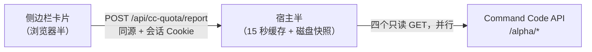

<div align="center">

# Command Code 额度面板（DeepSeek Harness 插件）

**5 小时 / 每周 / 月度三条额度窗口，就在侧边栏「设置」上方。**

不用开浏览器、不用登录、不用猜这个月还剩多少。

[](LICENSE)
[](https://github.com/deepseek-ai/deepseek-harness)
[](#环境要求)
[](README.md)


</div>

---

## 你会得到什么

| | |
|---|---|
| **三条窗口一眼看完** | 5 小时 / 每周 / 月度，短的在上——最紧的那条就在你视线第一落点 |
| **百分比优先** | 主值按整数取整，和 Command Code 官方面板一致，卡片和官网不会对不上 |
| **钱只在要紧的地方** | 月度额度给出已用与剩余金额；每一行的精确数字悬停可见 |
| **先出现，再实时** | 重启后约 **2ms** 卡片就在屏幕上，约 1 秒后换成实时值 |
| **该消失时消失** | 没配 Command Code 的机器上，卡片完全不渲染 |
| **中英双语** | 跟随 DSH 界面语言 |

卡片上的一切都来自**你自己账号的数据**——窗口数量、上限、百分比都是接口读出来的，不做假设。Go / GOAT / Pro / Provider / Max / Teams 都适用；接口没上报滚动窗口的套餐，就不画那几行。

## 安装

```sh
# 1. 把包装进 profile
dsh plugin --profile web add github:Jovan1666/dsh-commandcode-quota
```

```yaml
# 2. 注册插件行 —— 追加到 $DSH_HOME/profiles/web/cordis.patch.yml
- insert:
    - id: commandcode-quota
      name: "dsh-commandcode-quota"
```

```sh
# 3. 重启 dsh web，然后刷新浏览器页面
```

然后看侧边栏底部。设置就这么多——没有配置文件、不用填 API key：只要 Command Code 已经是你 DSH 设置里的一个 provider，插件自己会找到它。

<details>
<summary>其它安装方式，以及怎么卸载</summary>

**本地克隆安装**

```sh
git clone https://github.com/Jovan1666/dsh-commandcode-quota
dsh plugin --profile web add ./dsh-commandcode-quota
```

**不用 pnpm 的手动安装** —— 把目录链接进 profile 的 `node_modules`，再加上面那段 `cordis.patch.yml` 行：

```sh
# macOS / Linux
ln -s "$PWD/dsh-commandcode-quota" "$DSH_HOME/profiles/web/node_modules/dsh-commandcode-quota"
```

```powershell
# Windows
New-Item -ItemType Junction -Path "$env:USERPROFILE\.dsh\profiles\web\node_modules\dsh-commandcode-quota" -Target "$PWD\dsh-commandcode-quota"
```

**卸载**：删掉 `cordis.patch.yml` 里那一行、把包从 profile 里移除、重启 `dsh web`。想连缓存快照一起清掉，就删 `$DSH_HOME/dsh-commandcode-quota/`。

</details>

## 为什么卡片不用等

过去首屏要等完一整趟上游往返，而刚重启的 dsh 没有任何缓存——这就是"要过一会儿才出来"的来源。用 `node preview/latency.mjs` 对线上接口实测：

| 场景 | 耗时 |
|---|---|
| 重启后首个响应（磁盘有快照） | **约 2ms** |
| 重启后首个响应（首次运行、无快照） | 约 1.4s |
| 四个端点依次请求 | 约 2.3s |
| 四个端点同时请求 | 约 1.2s |

差距来自两件事：

1. **四个端点同时发。** `whoami` 原来是单独 `await` 的——为了拿一个个人账号根本不上报的 org id，白等约 590ms。
2. **最近一次成功报告留在磁盘上。** 冷启动时立刻返回它（变灰，并标注"上次成功多久前"），后台同时在拉实时值。卡片 3 秒后就再问一次，而不是等常规的一分钟——你看完数字的时候它已经是实时的了。

## 怎么读这张卡片

| 窗口 | 含义 | GOAT 档的值 |
|---|---|---|
| **5 小时** | 滚动突发限制——一次长会话抽不干整月额度 | `$14` |
| **每周** | 滚动 7 天限制 | `$35` |
| **月度** | 本计费周期的额度总额 | `$70` |

每行显示**已用百分比**（低于 60% 绿、低于 85% 黄、更高红）、同色进度条、以及**重置倒计时**（`59m` / `6d9h` / `8d1h`）。点击卡片展开：月度额度金额、剩余、请求数、token 用量。把侧边栏收成导轨，卡片变成 36px 圆徽，显示**最紧的那条**窗口的百分比。

### 数字口径

- 百分比是 `已用 ÷（已用 + 剩余）`，实时从接口算出；`preview/e2e-live.mjs` 可以随时对真实账号断言这个恒等式。
- 主值按整数取整，和官方取整方式一致。这就是为什么官网显示 `100%` 而精确值是 `99.84%`——同一份数据，两种取整。精确值和金额悬停可见。
- 月度总额是**两个端点**的数字相加得来的。跨计费周期或换套餐那一瞬，这两个数会分属两个周期，相加的结果看着正常、实际能差几十个百分点。套餐名义额度就是校验标尺；没过校验时宿主**不给任何百分比**，卡片会说明原因，下一次刷新自动校正。

### 刻意不做的几件事

侧边栏内容宽度只有约 200px，笔记本屏上小字会更小。所以卡片是把一个问题回答好——**我用到什么程度了**——而不是把接口返回的东西全摆出来：

- **金额只给月度。** 5 小时和每周是"能不能用"的闸门，不是预算；这两行的金额对用户没有可执行的信息。悬停时每行的精确数字仍在。
- **不做配速判断、不做消耗速度预测。** "超速"对一个有活要干的人没有意义；预测耗尽时间则假设消耗匀速，而实际从来不是。数据层仍在 JSON 里提供 `projection` 给脚本用。
- **什么都不静默。** 某个端点挂掉导致某行消失时，卡片会说出来；完全取不到数据时，给一行能读懂的说明，完整诊断文本放在悬停里。

## `/quota` 命令

在对话里输入 `/quota`，把同一份报告打印成文本：

```text
Command Code · GOAT (active)
5-hour 1.4% used · resets in 3h17m
Weekly 12.8% used · resets in 6d7h
Monthly 99.8% used · $70.11 / $70.23 · $0.11 left · resets in 7d22h
18,087 requests · 100% success · in 3.49B / out 16.77M
```

它读的正是卡片那份缓存报告，所以多敲一次命令不会多打上游接口——而且和卡片不同，它**从不**用磁盘快照作答：敲命令就是要当前数字。

## 环境要求

- **DeepSeek Harness** `^0.1.5-rc.1`。插件依赖若干尚未稳定的框架内部接缝，见[兼容性](#兼容性)。
- 一个**有 API 权限**的 Command Code 账号（除 $1 的 **Go** 档外都包含），见[套餐与订阅](#套餐与订阅)。
- Node.js 18+ —— 只有可选的命令行工具和开发脚本需要。

## 套餐与订阅

只要有 API 权限，卡片哪一档都能读。这个插件是照着 **GOAT** 做的：$10/月，拿到 $70 额度，另有 5 小时 $14、每周 $35 两道闸。

GOAT 是适合 agent 循环的那一档。Command Code 官方对 **DeepSeek V4 Flash** 的估算是一个月 **约 154,000 次请求**（5 小时约 30,800 次、每周约 76,900 次）——因为 flash 档的单价大致是每百万 token 输入 $0.15、输出 $0.60、缓存读取 $0.003。写代码的 agent 花的正是这类调用：单次很小、次数很多，上下文大部分从缓存里读。一个月几万轮工具调用是正常工作量，到这个价位先见底的是窗口闸和月度额度，而不是请求条数。

这两个数字有个前提，官方页面上写着：估算按一次典型 agent 请求约 800 个新输入 token、约 50,000 个缓存读取 token、125–200 个输出 token，所以带大仓库上下文的跑法会消耗得更快；DeepSeek 还按时段计价，高峰时段更贵（UTC 周一至周五 01:00–04:00、06:00–10:00）。官方同时声明额度随时可能调整——[定价页](https://commandcode.ai/docs/resources/pricing-limits)才是准的，上面的数字是 2026-09-19 读到的。

### 订阅步骤

1. 登录 [commandcode.ai](https://commandcode.ai/)，打开[定价页](https://commandcode.ai/pricing)，或者 Studio → Billing。
2. 选 **GOAT** 下单。信用卡/借记卡走 Stripe；**支持支付宝**，限美元计价的套餐，并且会签自动续费代扣——第一张账单之前先知道这件事比较好。银联未列出。
3. 在 Studio 的 **API keys** 页点 Generate。key 长这样 `user_…`，不是 `sk-…`。
4. 交给 dsh。设置 → 模型 里可以交互式添加；改文件就在 `$DSH_HOME/settings.yaml` 里加一条 provider 路由：

   ```yaml
   llm-pi-ai:
     providers:
       command-code-goat:
         apiKeyEnv: COMMAND_CODE_GOAT_API_KEY
         api: openai-completions
         baseURL: https://api.commandcode.ai/provider/v1
         models:
           - id: deepseek/deepseek-v4.1-flash
             contextWindow: 1000000
             input: ["text", "image"]
   ```

   key 本身别写进这个文件：放环境变量，或者放 `$DSH_HOME/.credentials.yaml` 的 `refs.COMMAND_CODE_GOAT_API_KEY`。到这里就没了——[凭据解析](#凭据解析)说的就是卡片怎么找到这条同样的路由，所以装插件从不问你要 key。

### 订阅前须知

- **Go（$1）没有 API 权限。** 四个额度端点全部返回 404，插件会报「此套餐无 API 权限」，不会当成可重试的错误。
- **5 小时和每周两道闸从你第一次请求开始计时**，不按日历切；切换套餐会把这两道闸一起清零。卡片显示的是接口报出来的重置时刻，不拿周期起点去推算。
- **一人一号。** 条款禁止共享、转售、多账号轮用 key，违规会牵连涉及的每个账号永久封禁。
- **换档不影响这张卡片。** $20 的 **Pro**（$80 额度）结构相同、余量更大，$100 / $200 的 **Max** 再往上放大。$15 的 **Provider** 是计量的纯 API 接入、没有滚动窗口，卡片就只显示余额、不显示窗口行。

## 凭据解析

API key 只留在宿主端，浏览器拿不到。宿主按下面的顺序解析，并会报告最终命中的来源：

1. 显式传入的 key（命令行 `--key`）。
2. **从你自己的 `$DSH_HOME/settings.yaml` 里发现**——任何 `baseURL` 指向 `commandcode.ai` 的 provider 路由。插件读该路由的字面 `apiKey` 或其 `apiKeyEnv`，再按名字去环境变量和 `$DSH_HOME/.credentials.yaml` 里找。主机名会被保留（指向 staging 或代理都行），但只取 origin：额度端点在主机根路径上，不在 provider 的 `/provider/v1` 路径下。
3. 环境变量：`COMMANDCODE_API_KEY`、`COMMAND_CODE_API_KEY`、`CMD_API_KEY`，再兜底**任何**名字里含 `commandcode` 的变量。
4. `$DSH_HOME/.credentials.yaml` 里的同名引用（`refs.<NAME>`）。
5. `~/.commandcode/auth.json`——官方 `command-code` CLI 的登录态。

第 2 步是"别人也能用"的关键：它跟随**你自己的** provider 配置，而不是写死某一种命名习惯。

<details>
<summary><strong>工作原理</strong>——端点、接缝，以及踩过的那个坑</summary>



| 端点 | 用途 |
|---|---|
| `/alpha/whoami` | 账号名、org id |
| `/alpha/usage/summary` | 本周期已用额度、请求数、成功率、token |
| `/alpha/billing/credits` | 剩余额度、5 小时与每周窗口 |
| `/alpha/billing/subscriptions` | 套餐 id、状态、计费周期起止 |

四个端点各自独立降级：单个失败记进报告的 `failures`，在卡片上以一行浅灰说明呈现，其余照常渲染。四个全失败时只抛一个错误并带上最具体的错误码——包括四个都返回 404 时的"当前套餐不含 API 权限"。

</details>

## 兼容性

插件依赖若干尚未成为稳定公开 API 的框架接缝，每一条都对着 `dsh 0.1.5-rc.1` 的真实实现：

| 接缝 | 用途 |
|---|---|
| `sidebar.footer.action` 插槽 | 「设置」上方那个位置，两种侧边栏宽度下都成立 |
| `ctx.slots.register({ name, id, order, inject }, Component)` | 贡献卡片 |
| `ctx.connection.rpc.call(channel, endpoint, payload, signal)` | 浏览器侧的请求 |
| `ctx.connection.fetch.register({ path, methods, requestBody, fetch })` | 宿主侧的路由 |
| `ctx.get('commands')` + `commands.register({ name, description, handler })` | 可选的 `/quota` 斜杠命令 |
| `dsh.client` 清单 + `exports["./client"]` | 客户端 bundle 发现，服务于 `/plugins/<id>/client.js` |

> **为什么用精确 Fetch 路由而不是 `connection.rpc.handle`？** `rpc.handle` 挂载通道走的是 `owner.webServer`，而 `owner` 是 Connection 服务自己的 context——那里永远没注入 `webServer`。任何其他插件调用它都会抛 `cannot get property "webServer" without inject`，调用方 inject 什么都没用。`connection.fetch.register` 只写内部路由表，任何插件 fiber 都能用，而且天然继承共享 `/api` 传输的 Host/Origin 校验与浏览器会话 Cookie。

未来 dsh 版本改动其中任何一条，插件会在加载时明确报错，而不是静默渲染空白。

## 命令行工具（可选）

同一份数据层也打包成零依赖的只读命令行工具——适合无头机器，或想查第二个账号时：

```sh
node cli/cli.mjs              # 渲染一次
node cli/cli.mjs --watch 60   # 每 60 秒刷新
node cli/cli.mjs --json       # 归一化 JSON，给脚本消费
node cli/cli.mjs --help
```

```text
Command Code · GOAT（individual-goat） · Jovan1666
key: $DSH_HOME/.credentials.yaml → refs.COMMAND_CODE_GOAT_API_KEY

5 小时     ---------------------------- 1.4%
           今天 21:55 重置（2 小时 4 分后）

每周       ####------------------------ 12.8%
           09-24 01:51 重置（6 天 6 小时后）

月度额度   ############################ 99.8% · $70.11 / $70.23
           剩余 $0.11 · 09-25 17:08 重置（7 天 21 小时后）
本周期  18,087 请求 · 成功率 100% · in 3.49B / out 16.77M tokens
```

这里展示的是 `--ascii` 模式的输出，是刻意的：默认进度条用的是满行高的块字符，在很多等宽字体里会和紧挨着的那行文字糊在一起——本 README 之前就是这样，每周的进度条和上面 5 小时的重置时间粘成了一块。`#` 和 `-` 是普通字形，到哪儿都正常。另外没有分隔线、也没有右对齐列，每一行都自洽，不依赖字符宽度。

参数：`--json` / `--watch [秒]` / `--ascii` / `--color` / `--no-color` / `--base <url>` / `--timeout <ms>` / `--key <key>`。

命令行工具与卡片同一套取舍：金额只给月度，不做配速判断和消耗预测（那些数字仍在 `--json` 里）；它的**人类可读输出是中文**，`--json` 与语言无关，是给脚本用的接口。

## 排查

| 现象 | 含义与处理 |
|---|---|
| 完全没有卡片 | 这台机器没配 Command Code provider，插件按设计保持不可见。去「设置 → Models」确认。 |
| 卡片显示错误 | 卡片会给你能读懂的一句话（"连不上 Command Code"、"API key 被拒绝了"），悬停可看完整诊断文本。 |
| `/plugins/dsh-commandcode-quota/client.js` 返回 404 | 客户端 bundle 没被组合。确认 `package.json` 里有 `dsh.client.platform === "web"` 和 `exports["./client"]`。 |
| 改了 `client.js` 没生效 | 刷新页面即可——bundle 每请求现读磁盘。改的是 `index.js` 或 `quota.mjs` 就必须重启 `dsh web`（Node 会缓存模块）。 |
| 数字变灰 | 宿主返回的是磁盘快照，或某次刷新失败。下面会标出距上次成功多久，下一次刷新自动恢复。 |
| 全是 `—` | 该套餐没上报窗口，或者某次读取还在路上。 |
| 移除 Command Code 后面板变空 | 这是对的——插件不会为已经不存在的 provider 展示旧快照。 |

## 隐私

- API key 只留在宿主端。浏览器拿不到 key，只通过同源 `/api` 传输收到归一化报告，而该传输另外还限制在 loopback 并要求本进程的浏览器会话 Cookie。
- 只和你的 Command Code 账号 API 通信。没有遥测、没有统计、没有第三方端点。
- 本地唯一写入的文件是最近一次报告的快照：`$DSH_HOME/dsh-commandcode-quota/last-report.json`。它存的就是卡片上那些数字——**不含 key**，另外只存 key 的一小段摘要，用来确认这份快照属于当前配置的账号。随时可以删掉，插件会重建。
- 除这个快照外，每次刷新都是对四个只读端点的实时读取。

## 开发

```sh
# 1. React 只有组件测试和预览页需要
mkdir .devdeps && cd .devdeps && npm init -y && npm install react@18 react-dom@18 && cd ..

# 2. 一次跑完全部 —— 129 项，一个结论，不碰网络也不读真实凭据
node scripts/verify.mjs           # 加 --live 会额外打真实账号
node scripts/verify.mjs --quiet   # 每个套件只打一行汇总
```

```text
ok    quota   (discovery contract)            15 checks
ok    host    (route, cache, concurrency)     28 checks
ok    client  (rendering, boundaries)         53 checks
ok    dynamic (drift, resets, bad payloads)   30 checks
ok    cli     (arguments, exit codes)           3 checks
ok    audit   (credentials, host paths)
```

| 脚本 | 作用 |
|---|---|
| `node scripts/verify.mjs` | 全部套件 + 单一退出码；`--live` 追加两个读真实账号的套件 |
| `node scripts/audit.mjs` | 提交前扫描凭据特征与本机专有内容 |
| `node preview/latency.mjs` | 首屏时间拆解：各端点耗时 + 冷启动前后对比 |
| `node preview/build.mjs` | 把**真实的 `client.js`** 渲染进仿真侧边栏（浅/深色、折叠/展开；加 `--with-snapshot` 多一列"重启瞬间"）供无头截图，不用重启 `dsh` |
| `node preview/e2e-live.mjs` | 一次真实读取：打印 `/quota` 文本并断言 `已用 + 剩余 = 总额` |
| `node preview/e2e-watch.mjs 6 20` | 对真实账号采样 6 次，断言数字在变化中依然自洽 |

确定性是靠**重复**验证的，不是靠读一遍代码：`for i in 1 2 3 4 5; do node scripts/verify.mjs --quiet; done` 每次都应打出同样的总数。

## 已知限制

- **轮询而非推送。** 面板 60 秒刷新一次（有窗口接近上限时提速到 15 秒，已用尽则不再提速），宿主另有 15 秒缓存。额度变化最多滞后一分钟。
- **没有按模型分配的明细。** Command Code 把月度额度按模型分配，但 `/alpha` 端点不暴露那张表，卡片只能给总额。
- **不记录历史。** 每次都是实时快照，本地除了那一份缓存报告不存任何东西。
- **只覆盖 Command Code。** 不替代 dsh 自己的本地 token 统计（在 `$DSH_HOME/dsh-usage/`）。
- **依赖框架内部接缝。** 见[兼容性](#兼容性)，未来的 dsh 版本需要跟着看一眼。

## 参与

欢迎提 issue 和 PR。开 PR 前先跑 `node scripts/verify.mjs`——它应该是绿的，而且新行为应该带一条"改之前会失败"的检查。

## 许可

MIT —— 见 [LICENSE](LICENSE)。

<div align="center">
<sub>English: <a href="README.md">README.md</a></sub>
</div>
