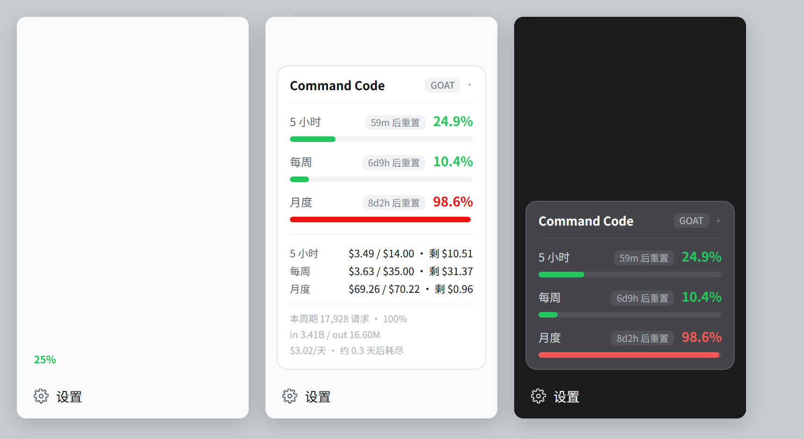

# dsh-commandcode-quota

**在 DeepSeek Harness 侧边栏看 Command Code 套餐额度** —— 5 小时 / 每周 / 月度三条额度窗口，渲染在「设置」正上方。

[](LICENSE)
[](https://github.com/deepseek-ai/deepseek-harness)
[](#参与贡献)

[English README](README.md) | **简体中文**



---

## 为什么做这个

Command Code 的套餐便宜，但额度被拆成三个互相独立的窗口，而唯一能看到它们的地方是官网。如果你像本插件的作者一样，把 **GOAT** 套餐接到 DeepSeek Harness 里写代码，那在请求失败之前，你根本不知道自己离上限还有多远。

这个插件把三条窗口放到你本来就会看的地方——侧边栏底部、「设置」正上方。一眼就能看到，不用再开一个浏览器标签页。

## 它显示什么

| 窗口 | 含义 | GOAT 套餐的值 |
|---|---|---|
| **5 小时** | 滚动突发限制，防止一次长会话抽干整月额度 | `$14` |
| **每周** | 滚动 7 天限制 | `$35` |
| **月度** | 本计费周期的额度总额 | `$70` |

**最短的窗口排最上面**，最紧的约束落在视线第一落点上。每行显示：

- **已用百分比**作为主值，按紧急度着色（< 60% 绿、< 85% 黄、更高红）；
- 同色的**满宽进度条**；
- 一个灰底胶囊显示**重置倒计时**（`59m` / `6d9h` / `8d1h`），不用点也不用算。

点击卡片展开：百分比背后的金额、本周期用量统计、消耗速度与预计耗尽。把侧边栏收成 56px 导轨时，卡片缩成一个 36px 圆徽，显示最短窗口的百分比。

卡片上的一切都来自**你账号自己的数据**——窗口数量、上限、百分比都是接口读出来的，不做假设。接口没上报滚动窗口的套餐（比如按量付费的 **Provider**）就不画行。Go / GOAT / Pro / Max 10× / Max 20× / Provider / Teams 都适用。

## 环境要求

- **DeepSeek Harness** `^0.1.5-rc.1`。插件依赖若干尚未稳定的框架内部接缝，见[兼容性](#兼容性)。
- 一个**有 API 权限**的 Command Code 账号（除 $1 的 **Go** 档外都包含）。
- Node.js 18+（只有可选的命令行工具需要）。

## 安装

### 1. 把包装进 profile

```sh
# 直接从 GitHub 装
dsh plugin --profile web add github:Jovan1666/dsh-commandcode-quota

# 或者从本地克隆装
git clone https://github.com/Jovan1666/dsh-commandcode-quota
dsh plugin --profile web add ./dsh-commandcode-quota
```

`dsh plugin` 只是把参数转发给 profile 目录里的 pnpm，所以包名必须能从 `$DSH_HOME/profiles/web/node_modules` 解析到。

### 2. 注册插件行

`dsh plugin add` **只装依赖，不组合插件**。往 `$DSH_HOME/profiles/web/cordis.patch.yml` 加一个 insert 块：

```yaml
- insert:
    - id: commandcode-quota
      name: "dsh-commandcode-quota"
```

> `name` 要加引号，且必须和安装后的包名完全一致——loader 把它当模块说明符导入。

### 3. 重启并刷新

停掉正在跑的 `dsh web` 重新启动，然后**刷新浏览器页面**。`window.__DSH_BOOT__` 是在页面被服务时注入的，页面加载之后才出现的插件不会被拉取。

### 备选：不用 pnpm 的手动安装

不想动 profile 的依赖图，就自己建链接再加同样的 insert 块：

```powershell
New-Item -ItemType Junction `
  -Path "$env:DSH_HOME\profiles\web\node_modules\dsh-commandcode-quota" `
  -Target "C:\path\to\dsh-commandcode-quota"
```

## 配置

**没有配置。** 装上就能找到你的凭据。

## 使用

| 操作 | 结果 |
|---|---|
| 看侧边栏底部 | 三条窗口、百分比、进度条、重置倒计时 |
| 点击卡片 | 展开金额、周期统计、token 量、消耗速度与预计耗尽 |
| 悬停某行 | 精确的 `已用 / 总额`、剩余额度、绝对重置时刻 |
| 收起侧边栏 | 卡片变成 36px 圆徽，显示最短窗口的百分比 |

卡片每 60 秒刷新，宿主半另有 15 秒缓存。

## 凭据解析

API key 不会进浏览器。宿主半按下面的顺序解析，命中即停，报告里的 `credentialSource` 会告诉你实际用了哪一条：

1. 显式传入的 key（命令行的 `--key`）。
2. **从你自己的 `$DSH_HOME/settings.yaml` 发现**：任何 `baseURL` 指向 `commandcode.ai` 的 provider 路由。读该路由上的字面 `apiKey` 或它的 `apiKeyEnv`，再拿这个名字去环境变量和 `$DSH_HOME/.credentials.yaml` 解析。发现到的地址**只取 origin**——额度端点在主机根路径 `/alpha/*` 上，而 provider 的 baseURL 带 `/provider/v1` 路径。
3. 环境变量：`COMMANDCODE_API_KEY`、`COMMAND_CODE_API_KEY`、`CMD_API_KEY`，再退到**任何名字里含 `commandcode` 的变量**。
4. `$DSH_HOME/.credentials.yaml`（`refs.<NAME>`）或 `~/.dsh/.credentials.yaml` 里的上述名字。
5. `~/.commandcode/auth.json`（官方 `command-code` CLI 的登录态）。

**第 2 步是给别人用的关键**：它跟随**你自己的** provider 配置，而不是写死某一种命名习惯。你已经把 Command Code 配成 DSH 的 provider（设置 → Models）的话，什么都不用再做。

## 兼容性

插件依赖若干尚未成为稳定公开 API 的框架接缝，每一条都对着 `dsh 0.1.5-rc.1` 的真实实现：

| 接缝 | 用途 |
|---|---|
| `sidebar.footer.action` 插槽 | 「设置」上方那个位置，两种侧边栏宽度下都成立 |
| `ctx.slots.register({ name, id, order, inject }, Component)` | 贡献卡片 |
| `ctx.connection.rpc.call(channel, endpoint, payload, signal)` | 浏览器侧的请求 |
| `ctx.connection.fetch.register({ path, methods, requestBody, fetch })` | 宿主侧的路由 |
| `dsh.client` 清单 + `exports["./client"]` | 客户端 bundle 发现，服务于 `/plugins/<id>/client.js` |

> **为什么用精确 Fetch 路由而不是 `connection.rpc.handle`？** `rpc.handle` 挂载通道走的是 `owner.webServer`，而 `owner` 是 Connection 服务自己的 context——那里永远没注入 `webServer`。任何其他插件调用它都会抛 `cannot get property "webServer" without inject`，调用方 inject 什么都没用。`connection.fetch.register` 只写内部路由表，任何插件 fiber 都能用，而且天然继承共享 `/api` 传输的 Host/Origin 校验与浏览器会话 Cookie。

未来 dsh 版本改动其中任何一条，插件会在加载时明确报错，而不是静默渲染空白。

## 命令行工具（可选）

同一份数据层也提供零依赖的只读命令行，适合无 GUI 的机器或查看第二个账号：

```sh
node cli/cli.mjs              # 渲染一次
node cli/cli.mjs --watch 60   # 每 60 秒刷新
node cli/cli.mjs --json       # 归一化 JSON，给脚本消费
node cli/cli.mjs --help
```

```
Command Code · GOAT（individual-goat）                          Jovan1666
────────────────────────────────────────────────────────────────────────
月度额度   ███████████████████████████░ $69.26 / $70.22 · 98.6%
           剩余 $0.96 · 09-25 17:08 重置（8 天 1 小时后）
5 小时     ██████░░░░░░░░░░░░░░░░░░░░░░ $3.49 / $14.00 · 24.9%
           剩余 $10.51 · 今天 16:55 重置（59m 后）
每周       ███░░░░░░░░░░░░░░░░░░░░░░░░░ $3.63 / $35.00 · 10.4%
           剩余 $31.37 · 09-24 01:51 重置（6 天 9 小时后）
```

参数：`--json` / `--watch [秒]` / `--ascii` / `--color` / `--no-color` / `--base <url>` / `--timeout <ms>` / `--key <key>`。

错误码（退出码 2）：`MISSING_CREDENTIAL`、`AUTH`、`NOT_FOUND`（通常是套餐不含 API 权限）、`RATE_LIMIT`、`SERVICE`、`NETWORK`、`BAD_RESPONSE`、`USAGE`。

## 排查

| 现象 | 原因与处理 |
|---|---|
| 重启后完全没有卡片 | insert 块没加，或 `name` 和安装的包名不一致。用 `dsh --profile web --dump-config` 确认行在里面。 |
| 卡片出现但显示错误 | 宿主路由失败。悬停卡片看消息里的错误码：`MISSING_CREDENTIAL` 是没找到 key；`404` 通常是套餐不含 API 权限。 |
| `/plugins/dsh-commandcode-quota/client.js` 返回 404 | 客户端 bundle 没被组合。确认 `package.json` 里有 `dsh.client.platform === "web"` 和 `exports["./client"]`。 |
| 改了 `client.js` 没生效 | bundle 每请求现读磁盘，刷新页面即可；但如果改的是 `index.js` 或 `quota.mjs`，Node 已缓存模块，必须重启 `dsh web`。 |
| 全是 `—` | 账号没上报任何窗口（按量付费套餐），或报告还在加载。 |

## 隐私

- API key 只留在宿主端。浏览器拿不到 key，只通过同源 `/api` 传输收到归一化报告，而该传输另外还限制在 loopback 并要求本进程的浏览器会话 Cookie。
- 只和你的 Command Code 账号 API 通信。没有遥测、没有统计、没有第三方端点。
- 不持久化任何东西：每次刷新都是对四个只读端点的实时读取。
- 本地只读上面「凭据解析」里列出的凭据与设置文件。

## 工作原理

```
┌─ 浏览器 ──────────────────────────────────────────────┐
│ client.js  →  ctx.slots.register('sidebar.footer.action')
│            →  ctx.connection.rpc.call('/api', 'cc-quota/report')
└───────────────────────────┬───────────────────────────┘
                            │ POST /api/cc-quota/report
┌─ 宿主 ────────────────────┴───────────────────────────┐
│ index.js   →  ctx.connection.fetch.register(...)      │
│            →  15 秒缓存                                │
│ quota.mjs  →  凭据发现 + 4 个 /alpha/* 端点            │
└───────────────────────────┬───────────────────────────┘
                            │ Bearer <key>
                    api.commandcode.ai/alpha/*
```

| 文件 | 作用 |
|---|---|
| `client.js` | 浏览器半：卡片、样式表、轮询 hook。手写 bundle，无构建步骤，因此用 `React.createElement` 而非 JSX，并且只从前端的静态模块表取 `react`。 |
| `index.js` | 宿主半：共享 `/api` 传输上的一条精确 Fetch 路由，以及响应缓存。 |
| `quota.mjs` | 数据层：凭据发现、四个只读端点、归一化成与展示无关的报告。插件与命令行共用。 |
| `cordis.patch.yml` | profile 组合时加载插件用的 insert 块。 |

上游端点（全部只读 `GET`，Bearer 鉴权）：

| 端点 | 用到的字段 |
|---|---|
| `/alpha/whoami` | 账号身份、`org.id` |
| `/alpha/usage/summary` | `totalCredits`（本周期已用）、请求数、成功率、tokens |
| `/alpha/billing/credits` | `credits.monthlyCredits`（剩余）、`windowLimits.fiveHour` / `.weekly` |
| `/alpha/billing/subscriptions` | `planId`、`status`、`currentPeriodStart/End` |

四个端点各自独立降级：单个失败只记进报告的 `failures`，其余照常渲染；四个全失败才抛错，并带上最具体的错误码。

## 开发

```sh
# 1. 只有组件测试和预览页需要 React
mkdir .devdeps && cd .devdeps
npm init -y && npm install react@18 react-dom@18
cd ..

# 2. 离线测试 —— 40 项，不碰网络也不读真实凭据
node tests/quota.test.mjs     # 15  路由发现、凭据顺序、套餐表
node tests/host.test.mjs      #  9  路由注册、缓存、信封校验、失败路径
node tests/client.test.mjs    # 16  插槽注册、注入面、五种渲染状态

# 3. 可选：确认没有凭据或本机路径被提交
node scripts/audit.mjs
```

### 不重启 dsh 也能预览卡片

为了调样式去重启正在跑的 `dsh web` 太慢。`preview/build.mjs` 把**真实的 `client.js`** 渲染进一个仿真侧边栏（真实主题 token、浅色/深色、折叠/展开三列并排），再用 Chrome 无头模式截图：

```sh
node preview/build.mjs
chrome --headless=new --disable-gpu --hide-scrollbars \
  --force-device-scale-factor=2 --window-size=860,470 --virtual-time-budget=5000 \
  --screenshot=preview/shot.png "file://$PWD/preview/index.html"
```

主题 token 是从已安装的 `dsh-client-ui-theme` bundle 里**合并全部** `body{}` 与 `body[data-ds-dark-theme]{}` 块提取的。只取最后一块会漏掉 `--dsw-alias-state-*`，让所有进度条变透明——这个坑本仓库踩过一次。

## 已知限制

- **轮询而非推送。** 面板 60 秒刷新一次（宿主 15 秒缓存），额度变化最多滞后一分钟。
- **没有按模型分配的明细。** Command Code 把月度额度按模型分配，但 `/alpha` 端点不暴露那张表，卡片只能给总额。
- **耗尽预测是周期均值。** 用「已用 ÷ 已过天数」外推，忽略你最近换了模型或改变了工作强度。
- **不记录历史。** 每次都是实时快照，本地不存任何东西。
- **只覆盖 Command Code。** 不替代 dsh 自己的本地 token 统计（那个在 `$DSH_HOME/dsh-usage/`）。
- **依赖框架内部接缝。** 见[兼容性](#兼容性)。

## 参与贡献

欢迎提 issue 和 PR。开 PR 前请先跑那三套离线测试，并保持样式只用 harness 的 `--dsw-alias-*` 设计 token——测试会断言样式表里没有字面色值。

## 致谢

端点契约与套餐表对照过 [`@mars-sea/dsh-commandcode-provider`](https://github.com/Mars-Sea/dsh-commandcode-provider)（MIT），那是同一服务的非官方 provider 插件。

## 许可

[MIT](LICENSE)
